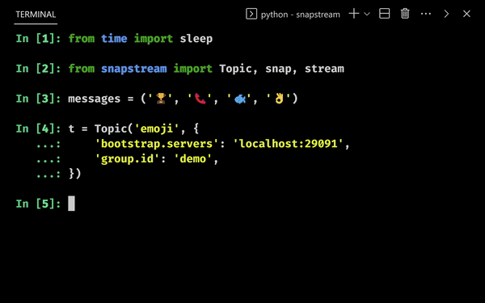

.. _index:

Kafka
=====

Spin up a local kafka broker using `docker-compose.yml <https://github.com/Menziess/snapstream/blob/master/docker-compose.yml>`_ to follow along:

.. code-block:: bash

  docker compose up broker -d

**Note:** check the logs before sending messages to Kafka, these messages may not be delivered until the broker is ready.

Here's the hello-world application using Kafka:

::

  from time import sleep

  from snapstream import Topic, snap, stream

  messages = ('🏆', '📞', '🐟', '👌')

  t = Topic('emoji', {
      'bootstrap.servers': 'localhost:29091',
      'auto.offset.reset': 'earliest',
      'group.instance.id': 'demo',
      'group.id': 'demo',
  })

  @snap(messages, sink=[t])
  def produce(msg):
      sleep(0.5)
      print(f'producing {msg}')
      return msg

  @snap(t, sink=[print])
  def consume(msg):
      val = msg.value().decode()
      return f'got: {val}'

  stream()

Some basic principles to remember:

- Any `iterable <https://pythonbasics.org/iterable/>`_ may act as a source of data
- Any callable can be used as a sink

- When we call ``stream()``, each iterable is processed in a separate thread
- Elements are published to each handler function (that's decorated using ``snap``)

::

  Producing 🏆
  got: 🏆
  Producing 📞
  got: 📞
  Producing 🐟
  got: 🐟
  Producing 👌
  got: 👌

These simple concepts offer interesting ways to establish complex arbitrary stateful streams.

**Note:** out of the box advanced features such as `synchronizing streams <https://menziess.github.io/howto/use/snapstream>`_  could be offered in the future, feel free to `contribute <https://github.com/Menziess/snapstream/pulse>`_!
